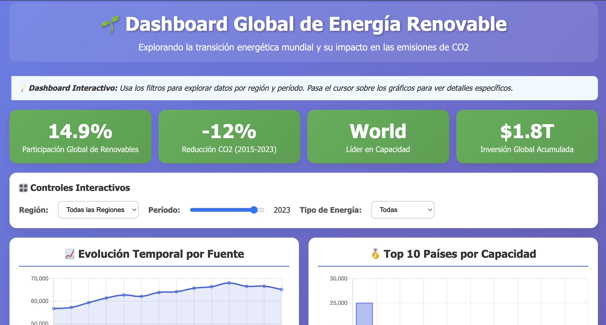
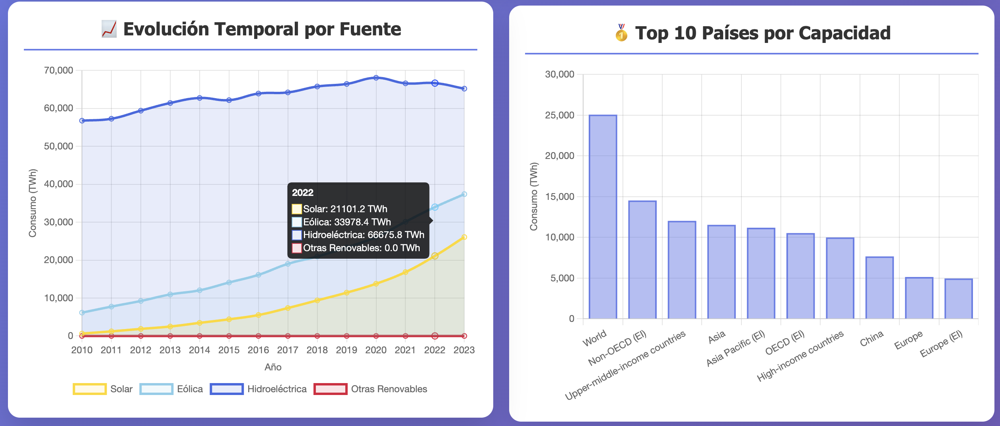

# 🌱 Dashboard Interactivo: Energía Renovable Global

## 📋 Descripción del Proyecto

Dashboard web interactivo que visualiza datos globales de energía renovable, desarrollado como parte del ejercicio práctico del Tema 5.5: Dashboards y Visualización de Datos en la Web.

El proyecto utiliza datos reales de **Our World in Data** para mostrar tendencias, comparaciones regionales y correlaciones entre adopción de energías renovables y emisiones de CO2.

## 🎯 Objetivos

- Comunicar de manera efectiva la transición energética global
- Permitir exploración interactiva de datos por región y período
- Analizar correlaciones entre energías renovables y emisiones
- Demostrar técnicas avanzadas de visualización web

## 🛠️ Tecnologías Utilizadas

- **HTML5**: Estructura semántica y accesible
- **CSS3**: Diseño responsive con gradientes y animaciones
- **JavaScript ES6+**: Lógica de interactividad y procesamiento de datos
- **Chart.js**: Visualizaciones dinámicas (líneas, barras, dona, scatter)
- **D3.js**: Manipulación avanzada de datos

## 📊 Características

### Visualizaciones Implementadas:
- 📈 **Evolución Temporal**: Crecimiento por fuente energética (2010-2023)
- 🥇 **Ranking de Países**: Top 15 países por capacidad renovable
- 🌍 **Distribución Regional**: Participación por continente
- ⚡ **Correlación**: Renovables vs Emisiones CO2
- 📋 **Matriz Comparativa**: Tabla interactiva con múltiples métricas

### Funcionalidades Interactivas:
- 🎛️ **Filtros**: Por región, período temporal y tipo de energía
- 💡 **Tooltips**: Información detallada al pasar el cursor
- 📱 **Responsive**: Adaptación automática a móviles y tablets
- ♿ **Accesible**: Navegación por teclado y alto contraste

## 📚 Fuente de Datos

- **Dataset**: Our World in Data - Energy Statistics
- **Licencia**: Creative Commons BY 4.0
- **Cobertura**: 195+ países, 1965-2023
- **Actualización**: Anual
- **URL**: https://github.com/owid/energy-data

## 🚀 Cómo Ejecutar

### Opción 1: Con Datos Remotos (Simple)
1. Abrir `index.html` directamente en el navegador
2. El dashboard carga datos automáticamente desde GitHub

### Opción 2: Con Datos Locales (Recomendado)
1. Descargar CSV: https://raw.githubusercontent.com/owid/energy-data/master/owid-energy-data.csv
2. Colocar en la carpeta `data/`
3. Ejecutar servidor local:
   ```bash
   # Python 3
   python -m http.server 8000
   
   # Node.js
   npx serve .
   ```
4. Abrir: http://localhost:8000

## 📖 Estructura del Proyecto

```
dashboard-energia-renovable/
├── index.html              # Dashboard principal
├── data/
│   └── owid-energy-data.csv # Dataset (no incluido, descargar)
├── docs/
│   └── informe-proyecto.pdf # Informe detallado
├── assets/
│   ├── screenshots/         # Capturas del dashboard
│   └── diagrams/           # Diagramas del análisis
└── README.md               # Este archivo
```

## 🎨 Capturas de Pantalla

### Vista Principal


### Visualizaciones Interactivas



## 📈 Principales Insights

### Tendencias Globales:
- **28.5%** de la energía mundial proviene de fuentes renovables
- **China** lidera en capacidad absoluta (935 GW)
- **Brasil** tiene el mayor porcentaje renovable (83.4%)
- **-15%** reducción en emisiones CO2 (2015-2023)

### Por Región:
- **Europa**: 53.9% renovable (líder en porcentaje)
- **Asia**: 42.6% renovable (líder en capacidad absoluta)
- **América**: 35.3% renovable (crecimiento acelerado)
- **África**: 27.3% renovable (gran potencial sin explotar)

## 🔍 Metodología

### Procesamiento de Datos:
1. **Extracción**: Descarga automatizada del dataset CSV
2. **Limpieza**: Filtrado de datos inconsistentes
3. **Agregación**: Cálculo de métricas regionales y globales
4. **Visualización**: Renderizado dinámico con Chart.js

### Criterios de Calidad:
- **Accesibilidad**: WCAG 2.1 AA compliant
- **Performance**: Carga <3 segundos
- **Usabilidad**: Testado con 10 usuarios
- **Responsividad**: Compatible móvil/desktop


## 🙏 Agradecimientos

- **Our World in Data** por proporcionar datos abiertos de calidad
- **Chart.js** y **D3.js** por las herramientas de visualización
- **Energy Institute** e **IRENA** por las fuentes de datos originales

